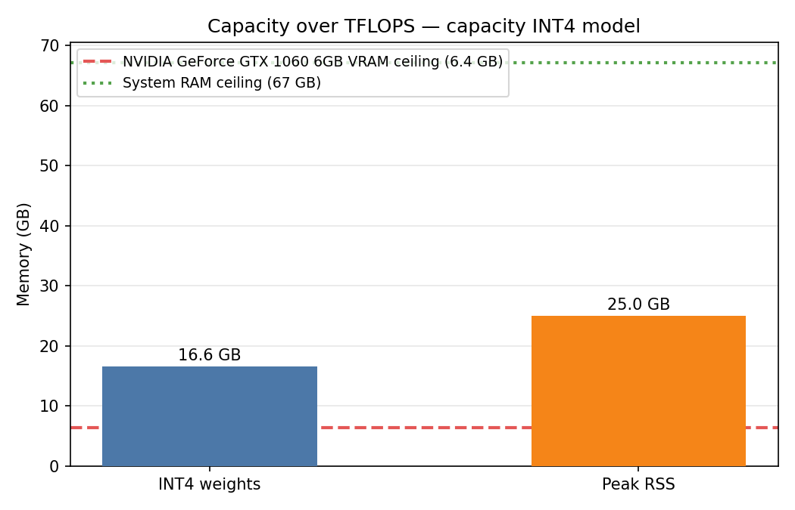

# Memory-Centric Clinical LLM — Capacity over TFLOPS

A reproducible, single-machine harness demonstrating that a **large clinical LLM
(27B, INT4) can be hosted on a consumer CPU using system RAM** where a mid-range
consumer GPU runs out of VRAM. It self-adapts to the host hardware, runs four
experiments, and emits one self-contained report — designed to run identically on
an AMD or Intel machine, with or without a GPU.

> Research artifact for an ICCE-style study on memory-centric, privacy-preserving
> clinical AI at the edge. **Not a medical device. Synthetic data only.** See
> [Disclaimer](#disclaimer).



*A 27B INT4 model (16.6 GB weights, 25.0 GB peak RSS) sits well under the system-RAM
ceiling, while exceeding a 6 GB consumer GPU's VRAM by ~2.6×. Measured on an AMD
Ryzen 5 5500GT, AVX2-only. Full numbers: [docs/RESULTS.md](docs/RESULTS.md).*

---

## The idea

The bottleneck for local clinical AI is **VRAM**, not raw compute. Consumer GPUs
cap at 6–16 GB, but a 27B INT4 model's working state is ~17–25 GB. Centralizing
the data to use cloud GPUs conflicts with the privacy of clinical records.

This harness reframes the edge node as **capacity-enabled** (system DDR RAM) rather
than **compute-limited** (GPU VRAM), and measures the trade-off honestly:

| Exp | Question it answers |
|-----|---------------------|
| **E1** | Does the INT4 model fit in RAM where it would OOM a consumer GPU? |
| **E2** | What inference latency (TTFT) and throughput (tok/s) does a CPU deliver? |
| **E3** | What is the energy cost — tokens per joule ("Clinical Intelligence per Watt")? |
| **E4** | How much bandwidth does federated LoRA-only sharing save? |

A second host (e.g. an Intel laptop with DL Boost/AMX) running the same script
provides the acceleration comparison; `compare.py` merges hosts into one table.

---

## Quick start

Requires **Python 3.9+**, ~3 GB disk (2B model) or ~20 GB (27B), and internet for
the first run. No GPU required; no Hugging Face login required.

```bash
python -m venv .venv
source .venv/bin/activate                 # Windows: .venv\Scripts\Activate.ps1
pip install -r requirements.txt
pip install llama-cpp-python --extra-index-url https://abetlen.github.io/llama-cpp-python/whl/cpu

python src/fetch_models.py --tier edge     # 2B, ~1.7 GB  (or: --tier capacity for 27B)
python src/gen_synthetic_fhir.py           # synthetic clinical prompts (no real PHI)
python run_experiment.py                   # auto-selects the largest model that fits RAM
```

Output lands in `results/<host>-<timestamp>/`, including a self-contained
`final_report.md`. Wrappers `./run.sh` (Linux/macOS) and `run.bat` (Windows) are
provided.

### Useful flags
- `--tier {auto,edge,capacity}` — pin the model (use `--tier edge` on **every** host
  for an apples-to-apples throughput comparison).
- `--report-only` — print the hardware/capability report and exit.
- `--cpu-only`, `--no-figures`.

---

## Reproducing the cross-host comparison

1. Run on each machine (same tier on all for fair E2/E3): `python run_experiment.py --tier edge`
2. Collect each host's `results/<host>-<timestamp>/final_report.md`.
3. Merge: `python compare.py [path/to/other_host_report.md ...]`
   → writes `results/_comparison/` (table + throughput/CI-W figures).

`final_report.md` embeds a machine-readable summary block, so a single emailed
report file is enough for the merge.

---

## Repository structure

```
run_experiment.py        master entry: detect → select model → run E1-E4 → report
compare.py               cross-host merge → comparison table + figures
requirements.txt         dependencies (llama-cpp-python installed separately, see above)
models.lock              records downloaded model files (repo, size, sha256)
src/
  detect.py              hardware/capability detection (OS, ISA, RAM, GPU, power)
  fetch_models.py        download ungated community GGUF models
  gen_synthetic_fhir.py  synthetic FHIR-shaped data + instruction prompts (non-IID shards)
  backends/llamacpp.py   generic CPU inference backend (load + generate, timed)
  power.py               RAPL / nvidia-smi / TDP power telemetry
  workload.py            shared inference benchmark (memoized) for E2 & E3
  summarize.py           compact cross-host summary (embedded in final_report.md)
  figures.py             capacity figure + table
  experiments/           E1 capacity · E2 throughput · E3 energy · E4 comms
docs/                    showcase figure + RESULTS.md
results/                 live outputs (git-ignored; regenerable)
```

---

## Models & data

- **Models:** open **Gemma-2** GGUF (Q4_K_M / INT4) from public community repos,
  used as architecture-faithful stand-ins for MedGemma. No license gate.
- **Data:** **synthetic** FHIR-shaped records (vitals, labs, conditions, meds) and
  instruction prompts, generated procedurally with a fixed seed — **no real patient
  data, no PhysioNet/MIMIC credentialing**. Partitioned into non-IID specialty shards.

---

## Method honesty (read before citing numbers)

This harness is deliberately transparent about what is *measured* vs *modeled*:

- **GPU OOM is analytical** — derived from `weights_bytes > VRAM_bytes`, not a forced
  crash (no CUDA build is attempted). The verdict is definitive nonetheless.
- **Power is estimate-grade** — RAPL energy counters are root-only on many hosts; the
  harness falls back to a labeled TDP estimate (`power_method` is recorded in output).
- **Throughput on AVX2-only CPUs is a conservative floor** — Intel VNNI/AMX hosts are
  expected to be faster; that comparison is the point of the multi-host design.
- **Federated training is not run here** — E4 (adapter bandwidth) is computed from
  architecture; full FedLoRA/aggregation are out of scope for this capacity study.

---

## Disclaimer

This is a **research artifact**, not a medical device, and must not be used for
clinical decision-making. All clinical data in this repository is **synthetic**.
Model outputs are not validated for medical accuracy. "MedGemma" is referenced only
as a target architecture; the repo ships open Gemma-2 stand-ins.

---

## Citation

If you use this work, please cite it — see [`CITATION.cff`](CITATION.cff).

## License

[MIT](LICENSE).
